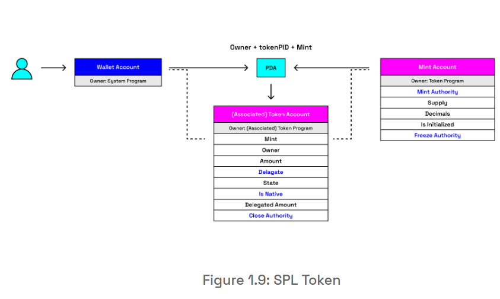

# Solana Training (Jun-Aug 2024)

## Pre-requisites

- Node.js v20 or later
- TypeScript v9 or later
- npm v10 or later
- install dependencies with `npm i`
- create an environment file based on `.env.example` with `cp .env.example .env`

### Lab 1

**Generate a new Solana keypair**

Run 

```bash
npx esrun generate-keypair.ts
```

Output format should be similar to:

```bash
The public key is:  CcrogdXjjCrQeCNhdFFioHrj44oygobsGMbsnAYU3MfB
The secret key is:  Uint8Array(64) [
   42,  13, 144, 105,  41,  69, 130,  32, 240,  59,  89,
   33, 130,  77, 108, 205, 191, 215, 187,   1, 234, 113,
   60, 244,  71, 122,  70,  90,   8,   5,  26, 171, 172,
  160,  50, 246,  54,  48, 222,  72,  99,  34, 165, 167,
   79,   0,  28, 206, 238,  44,  31, 163, 152,  80,   2,
  205, 242, 110, 118,  37,  99, 223,  65, 150
]
✅ Finished!
```

**Load the keypair from the environment file**

Copy the secret key and paste it in the `.env` file as the value for `SECRET_KEY`. Should look like:

```bash
SECRET_KEY=[
   42,  13, 144, 105,  41,  69, 130,  32, 240,  59,  89,
   33, 130,  77, 108, 205, 191, 215, 187,   1, 234, 113,
   60, 244,  71, 122,  70,  90,   8,   5,  26, 171, 172,
  160,  50, 246,  54,  48, 222,  72,  99,  34, 165, 167,
   79,   0,  28, 206, 238,  44,  31, 163, 152,  80,   2,
  205, 242, 110, 118,  37,  99, 223,  65, 150
]
```

Run 
```bash
npx esrun load-keypair.ts
```

Output format should be similar to:

```bash
✅ Finished! We've loaded our keypair securely, using an env file! Our public key is: CcrogdXjjCrQeCNhdFFioHrj44oygobsGMbsnAYU3MfB
```


### Lab 2

**Interact with Solana Devnet**

Set the Solana Devnet cluster as the default cluster for the Solana CLI tool:
```bash
solana config set --url https://api.devnet.solana.com
```

Send 1 SOL to the public key generated in Lab 1:
```bash
solana airdrop 1 CcrogdXjjCrQeCNhdFFioHrj44oygobsGMbsnAYU3MfB
```

Run 
```bash
npx esrun check-balance.ts
```

Output format should be similar to:

```bash
connected to devnet
devnet url https://api.devnet.solana.com
public key CcrogdXjjCrQeCNhdFFioHrj44oygobsGMbsnAYU3MfB
balance for wallet CcrogdXjjCrQeCNhdFFioHrj44oygobsGMbsnAYU3MfB is 1 SOL
```

**Import account to Phantom wallet**

Run 
```bash
npx esrun secretkey-to-b58.ts
```

Copy the output and import it to the [Phantom wallet](https://help.phantom.app/hc/en-us/articles/15079894392851-Importing-an-Existing-Wallet-into-Phantom).


### Lab 3

**Send SOL from an account to another**

Run
```bash
npx esrun transfer.ts
```

Output format should be similar to:
```bash
Sender balance: 12.699985 SOL
Reciever balance: 0.3 SOL
✅ Transaction confirmed, signature 53odoArL45T8BfWcRhGFcfUUSrpD6yrWEHSR3LWVfDwSLSPNS47DnbrvFjf5azZ9sY6PNoFit9XHP7juPA6hmb7b
Sender balance: 12.59998 SOL
Reciever balance: 0.4 SOL
```

### Lab 4

**Make and transfer Tokens**

*Notice: Solana does not require you to deploy a new contract for each token created. Instead, the Token Program will create and mint tokens on behalf of you.*



#### Create Mint Account

Defines a specific token. It has its own address where all the token details are stored.

Run for creating a new token mint account:
```bash
npx esrun create-token-mint.ts
```

Output format should be similar to:
```bash
Token mint address: CzqfFRrnLBrqFvbgLzSLXDNhF4z6YS94zjdEc2hFXJYX
```

#### Create Token Account

Defines the ownership of a specific token. It has its own address.

Run for creating a new token account for the mint:
```bash
npx esrun create-token-account.ts
```

Output format should be similar to:
```bash
Token account address: 28qkpCHX5LjUdq4HzW7Rn7LFqZmxKjM6AXx1S8YsEQp3
```

#### Mint Tokens

Run for minting tokens:
```bash
npx esrun mint-tokens.ts
```

Output format should be similar to:
```bash
Transaction signature 1: 3DNWhn3dRutkwG9KzK2bsRRn1zHDjkGgxDnVEksH5fZRvXB28s5V6fuzpvwo6uDbPA7WVMMUKUWhPcfAeTDmNTg5
Transaction signature 2: UXkGYYBFgCHWwi1TSRVPMkarJn6v5UEZUhF6T8seaQFL9JVjMYcweEim8CnZuktdBvuX1L55HiaBxtsxe3oFt8p
```

First transaction is for minting 100 tokens to previously created token account. 
Second transaction is for minting 100 tokens to a random token account.

#### Transfer custom tokens

Run for transferring custom tokens:
```bash
npx esrun transferCustomTokens.ts
```

Output format should be similar to:
```bash
npx esrun transferCustomTokens.ts
```
